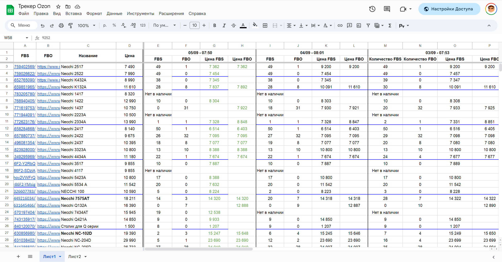
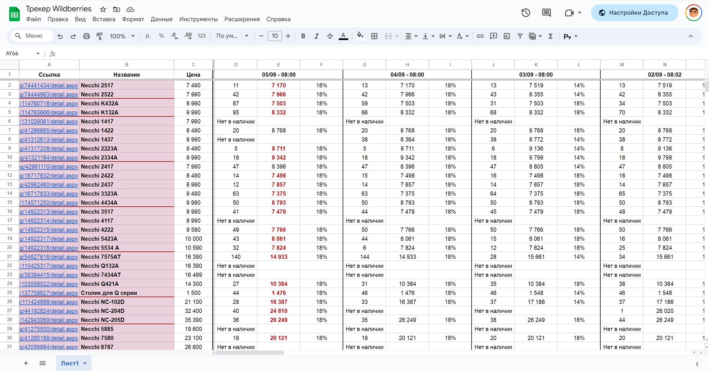

<h1 align=center><code>MarketplacesGoodsTracker</code></h1>
<div align=center>
  Quantity and price tracker for <b>Ozon</b> and <b>Wildberries</b> (based on <strike><a href="https://github.com/SeleniumHQ/selenium">selenium</a></strike> and <a href="https://github.com/burnash/gspread">gspread</a>)
</div>

## 📄 Preview

### Ozon


### Wildberries




## 📦 Installation

1. Clone the repository

    ```shell
    git clone
    ```

2. Rename `.env.dist' to `.env` and configure it

    ```shell
    cp .env.dist .env
    ```
   
3. Add `creds.json` to the root of the project

    ```shell
    mv /path/to/creds.json .
    ``

4.  Install the dependencies _(Optional, if not using Docker)_

    ```shell
    pip install -r requirements.txt
    ```

## 🚀 Usage

### Using Docker Compose _(with [just](https://github.com/casey/just))_

Run for both **Ozon** and **Wildberries**
```shell
just start
```

Or for **specific** marketplace
```shell
just start-oz
# or
just start-wb
```

Stop the app
```shell
just stop
```

> [!TIP]
> More commands can be found in [justfile](justfile)

### Using Pure Python

Run the app for **Ozon**

```shell
python run.py -oz
```

Or for **Wildberries**

```shell
python run.py -wb
```

Additional options can be shown with

```shell
python run.py -h
```

## 👥 Contributing

**Contributions are welcome! Here's how you can help:**

1. Fork it
2. Create your feature branch
3. Commit your changes
4. Push to the branch
5. Create a new Pull Request
6. Get your code reviewed
7. Merge your code
8. Get a 🌟


## 📝 License

This project is licensed under the GPL-3.0 License - see the [LICENSE](LICENSE) file for details
